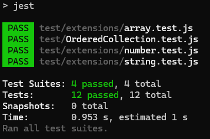

# Jest

When it comes to **JavaScript testing**, Jest is one of the most powerful and user-friendly frameworks available. Developed and maintained by Facebook, Jest is widely used.

- [JestJS (https://jestjs.io/)](https://jestjs.io/)

## Tip #1 - Extended Test Structure

By default Jest checks the /test directory for test case files - but you **might want to group more tests into additional subdirectories**. In such a case you have to modify your **package.json**

```
  ...
  "scripts": {
    "start": "node src/index.js",
    "test": "jest"
  },
  "jest": {
    "testMatch": [
      "**/test/**/*.test.js"
    ]
  },
  ...
```

## Tip #2 - Clear the cache

If **Jest** is picking up an old version of a package, clearing the cache might be necessary which is easy to do with the following command

```
npx jest --clearCache
npm test
```




